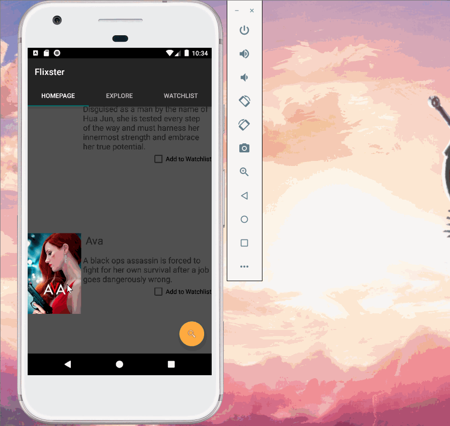

# Flixster
Flixster is an app that allows users to browse movies from the [The Movie Database API](http://docs.themoviedb.apiary.io/#).

## Flixster Part 1

### User Stories

#### REQUIRED (10pts)
- [x] (10pts) User can view a list of movies (title, poster image, and overview) currently playing in theaters from the Movie Database API.

#### BONUS
- [x] (2pts) Views should be responsive for both landscape/portrait mode.
   - [x] (1pt) In portrait mode, the poster image, title, and movie overview is shown.
   - [x] (1pt) In landscape mode, the rotated alternate layout should use the backdrop image instead and show the title and movie overview to the right of it.

- [ ] (2pts) Display a nice default [placeholder graphic](https://guides.codepath.org/android/Displaying-Images-with-the-Glide-Library#advanced-usage) for each image during loading
- [x] (2pts) Improved the user interface by experimenting with styling and coloring.
- [ ] (2pts) For popular movies (i.e. a movie voted for more than 5 stars), the full backdrop image is displayed. Otherwise, a poster image, the movie title, and overview is listed. Use Heterogenous RecyclerViews and use different ViewHolder layout files for popular movies and less popular ones.

#### Additional Features
The features below have been designed for portrait mode; a future update will handle landscape layout for the features below:
- [x] Include a explore page to browse movies by genres
   - [ ] Fetch movies based on genre
- [x] Include a watchlist page to save movie titles
   - [ ] Add selected movies to the watchlist fragment
   - [ ] Remove movies from watchlist
   - [ ] Persistence of saved movies in watchlist
- [ ] Allow users to search for movies
   - [x] Search fab on page
   - [ ] API call to find movie

### App Walkthough GIF

<blockquote class="imgur-embed-pub" lang="en" data-id="a/i01jIIk"  ><a href="//imgur.com/a/i01jIIk">Flixster Part 1</a></blockquote>

GIF created with [LiceCap](http://www.cockos.com/licecap/).

### Notes
Date: 09/25/2020  
Instead of just having one main activity, I decided to implement fragments in the app to have three tabs that would represent the homepage, explore page, and the watchlist page. The homepage includes the requirements for the assignment, but it was challenging to translate the code for an activity to a fragment. Namely, in main activity the method onCreate is used while in a fragment the method OnCreateView is used. It took several hours to debug, but I felt satisfied after being able to implement an app with three tabs. I still have future ideas for this app; namely adding functionality to the extra tabs of explore and watchlist since currently they serve as a placeholder for a future update.

### Open-source libraries used

- [Android Async HTTP](https://github.com/codepath/CPAsyncHttpClient) - Simple asynchronous HTTP requests with JSON parsing
- [Glide](https://github.com/bumptech/glide) - Image loading and caching library for Androids
